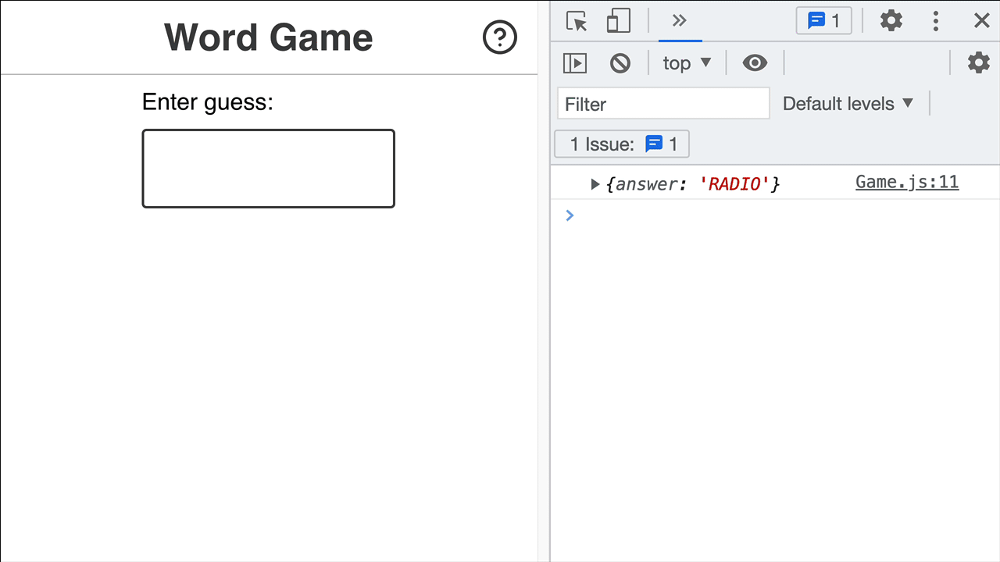

# Word Game

## [Joy of React](https://github.com/joy-of-react/project-wordle), Project I

In this project, we'll recreate a popular online word game, Wordle:


In Wordle, users have 6 attempts to guess a 5-letter word. You're helped along the way by ruling out letters that aren't in the word, and being told whether the correct letters are in the correct location or not.

## Exercise 1: GuessInput

First thing’s first: we need a way to submit guesses!

In the standard Wordle game, a global event listener registers keypresses. This isn't very accessible, and so we're going to do things a little bit differently.

We'll render a little form that holds a text input:


Your job in this first exercise is to create a new component for this UI, and render it inside the `Game` component.

Here's a minimal representation of the markup expected to be produced by this new component:

```html
<form class="guess-input-wrapper">
  <label for="guess-input">Enter guess:</label>
  <input id="guess-input" type="text" />
</form>
```

**NOTE:** This is the _minimal_ markup required, for the styles to be applied and for accessibility. **It isn't set in stone!** Feel free to make tweaks in order to match all of the acceptance criteria below.

Here's a quick screen recording of the expected result:



**Acceptance Criteria:**

- Create a new component.
  - Don't forget, you can use an NPM script to generate the scaffolding for you! We learn how to do this in the [“Getting Started” video](https://courses.joshwcomeau.com/joy-of-react/project-wordle/04-overview)
- This component should render a `<form>` tag, including a label and a text input.
- The text input should be controlled by React state.
- When the form is submitted:
  - The entered value should be logged to the console (for now).
  - The input should be reset to an empty string.
- **The user's input should be converted to ALL UPPERCASE.** No lower-case letters allowed.
- The input should have a minimum and maximum length of 5.
  - **NOTE:** The `minLength` validator is a bit funky; you may wish to use the `pattern` attribute instead. This is discussed in more detail on the [Solution page](https://courses.joshwcomeau.com/joy-of-react/project-wordle/06-solution#an-alternative-to-minlength).

## Exercise 3: Guess slots

In the real Wordle game, the initial screen shows 6 rows of 5 squares:


In this exercise, we'll update our code to display a similar grid. We'll show 6 rows of guesses, no matter how many guesses the user has submitted, and each row will consist of 5 cells.

As the user submits guesses, their guess will populate the cells:


Here's the DOM structure you'll want to create dynamically, based on the user's guesses:

```html
<div class="guess-results">
  <p class="guess">
    <span class="cell">H</span>
    <span class="cell">E</span>
    <span class="cell">L</span>
    <span class="cell">L</span>
    <span class="cell">O</span>
  </p>
  <p class="guess">
    <span class="cell">T</span>
    <span class="cell">H</span>
    <span class="cell">E</span>
    <span class="cell">R</span>
    <span class="cell">E</span>
  </p>
  <p class="guess">
    <span class="cell">W</span>
    <span class="cell">O</span>
    <span class="cell">R</span>
    <span class="cell">L</span>
    <span class="cell">D</span>
  </p>
  <p class="guess">
    <span class="cell"></span>
    <span class="cell"></span>
    <span class="cell"></span>
    <span class="cell"></span>
    <span class="cell"></span>
  </p>
  <p class="guess">
    <span class="cell"></span>
    <span class="cell"></span>
    <span class="cell"></span>
    <span class="cell"></span>
    <span class="cell"></span>
  </p>
</div>
```

**Things to know:**

There are two things that should help you tackle this exercise:

1. You can use the `range` utility to create arrays of a specified length to map over. It's provided in `/src/utils.js`. Check out the “Range Utility” lesson in the course for more info on how to use it.
2. Inside `/src/constants.js`, you'll find a constant, `NUM_OF_GUESSES_ALLOWED`. You should import and use this constant when generating the set of guesses. This would make it easy for us to change the difficulty of the game later on, by increasing/decreasing the # of guesses.

**Acceptance Criteria:**

- Create a new `Guess` component. 6 instances should be rendered at all times, no matter how many guesses have been submitted.
- The `Guess` component should render 5 spans, each with the class of `cell`.
- Each cell should contain a letter, if the `Guess` instance has been given a value. If not, the cell should be blank.
- Use the `NUM_OF_GUESSES_ALLOWED` constant, when needed.
- No `key` warnings in the console.
